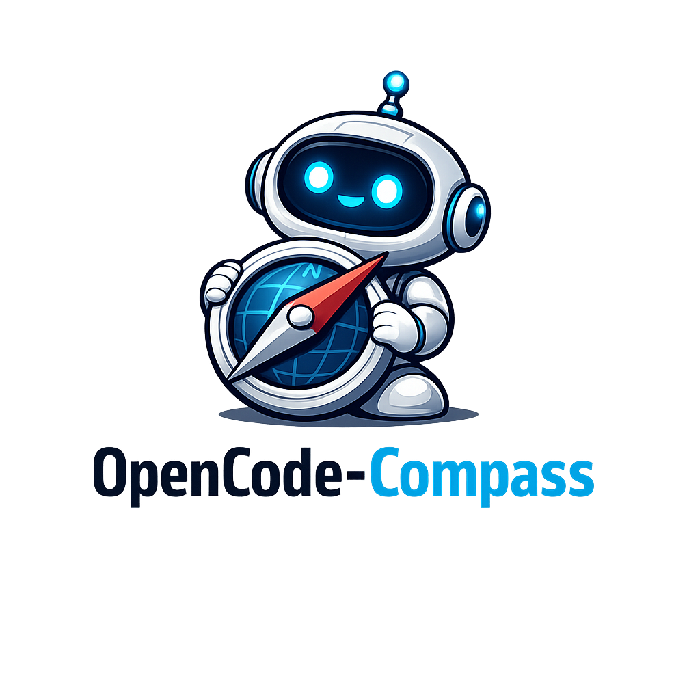

<p align="center">
  
</p>

> **Status**: Under active development. APIs and commands may change.

# opencode-compass

Navigate your codebase with confidence. A plugin that keeps your AI agents on course—from planning to PR.

## Why

Most AI coding setups give you raw model power, but not much workflow discipline. `opencode-compass` adds opinionated rails around common engineering tasks so agents can load the right context, follow a repeatable path, and stay grounded in the actual repo state.

## Why use this plugin

- Opinionated yet composable workflows for plan, dev, and review. `opencode-compass` gives you default rails for common engineering flows, while still letting teams enable only the commands they want and override templates, prompts, and components.
- Handcrafted tools for better performance and token efficiency. Instead of forcing agents to rediscover context through broad repo exploration, tools like `changes_load`, `pr_load`, and `ticket_load` return focused, structured data for the exact workflow at hand.
- Optimized for token-efficient execution. The plugin is designed to keep context compact: review flows load normalized PR metadata first, development flows reuse embedded guidance, and diff loading omits expensive or unnecessary payloads like full added-file bodies and binary patches.

## What it adds

- tools: `changes_load`, `pr_load`, `ticket_load`, `ticket_create`
- subagents: `reviewer`, `planner`
- commands: `/pr/create`, `/pr/review`, `/pr/fix`, `/ticket/plan`, `/ticket/dev`, `/review`, `/dev`
- embeddable navigation components for consistent guidance

## Review Workflow

- `/pr/review` starts with paginated, normalized `pr_load` metadata, then uses `changes_load` for the actual git-based file diffs, and publishes via `gh api`
- `/review` starts with `changes_load`, expands only the files that matter, and summarizes findings in chat

## Debug Scripts

- `./scripts/changes-load.ts --diff`
- `./scripts/changes-load.ts --base origin/main --head HEAD --diff`
- `./scripts/pr-load.ts --reviews --issueComments --threads`
- `./scripts/pr-load.ts --pr 123 --reviews --issueComments --threads`

## Tests

- `bun test`

## Install from npm

Add the package to your OpenCode config:

```json
{
  "plugin": ["opencode-compass"]
}
```

## Structure

```text
agents/          subagent prompts
commands/        command templates with embedded guidance
components/      reusable navigation guidance
lib/             shared loaders and path helpers
tools/           one file per tool
config.example.json  example configuration file
index.ts         plugin entrypoint
```

## Configuration

Create a configuration file at `.opencode/compass.json` or `opencode-compass.json` in your project root to customize behavior:

```json
{
  "commands": {
    "enabled": ["pr/create", "pr/review", "pr/fix", "ticket/plan", "ticket/dev", "review", "dev"],
    "templates": {
      "pr/create": "custom/path/to/pr-create.txt"
    }
  },
  "agents": {
    "enabled": ["reviewer", "planner"],
    "reviewer": {
      "description": "Custom reviewer description",
      "promptPath": "custom/path/to/reviewer.txt",
      "permission": {
        "edit": "deny"
      }
    }
  },
  "tools": {
    "enabled": ["changes_load", "pr_load", "ticket_load", "ticket_create"]
  },
  "components": {
    "enabled": ["pr-author", "dev-flow", "ticket-plan", "pr-fix", "pr-review"],
    "paths": {
      "pr-author": "custom/path/to/pr-author.txt"
    }
  },
  "defaults": {
    "baseBranch": "main",
    "agentMode": "all"
  }
}
```

See `config.example.json` for all available options.

## Test locally before publishing

Point OpenCode at the local entry file:

```json
{
  "plugin": ["file:///Users/danielpolito/Code/opencode-compass/index.ts"]
}
```

## Validate

```bash
bun run check
```

## Publish

```bash
npm publish --access public
```

The package is plain Bun-friendly ESM TypeScript, so there is no build step.
