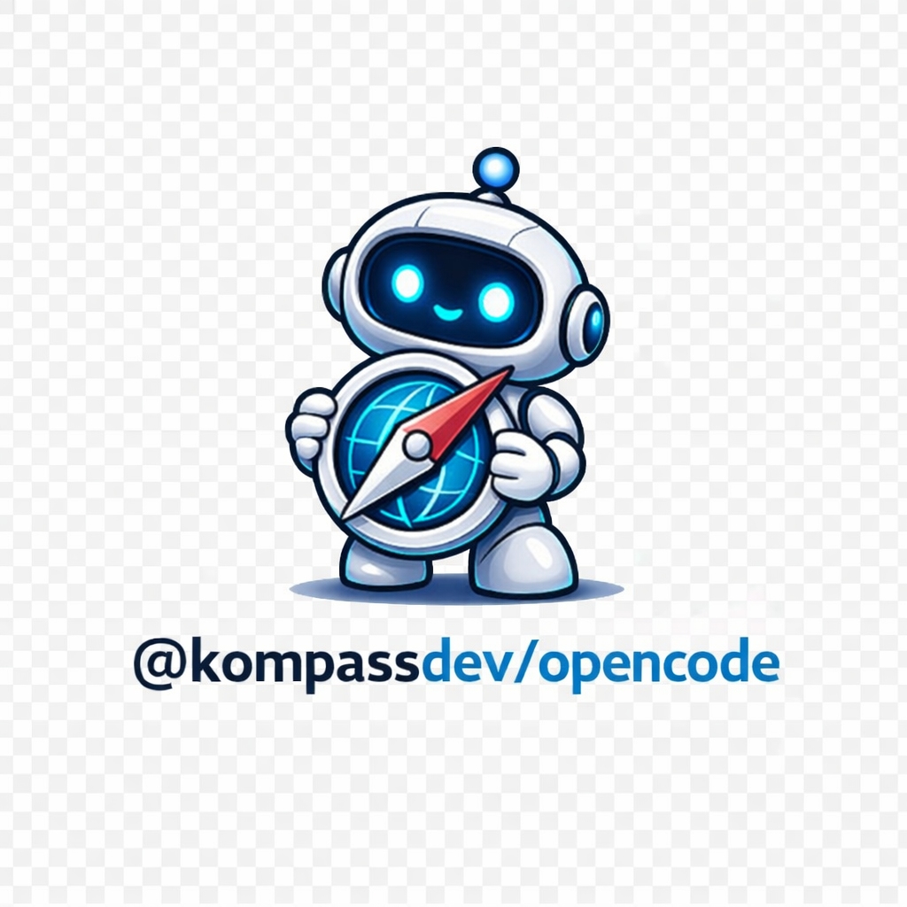

# @kompassdev/opencode

`@kompassdev/opencode` is an OpenCode plugin that helps your agent navigate repositories with fewer wrong turns.

It brings Kompass workflows, focused agents, and structured repository tools into OpenCode so sessions stay grounded in branch, PR, and ticket context instead of wandering through the repo from scratch.

`@kompassdev/opencode` is under active development, so commands, tools, and integration details may keep evolving as Kompass matures.

Why people use it:

- help OpenCode navigate codebases with more direction and less drift
- load branch, PR, and ticket context through purpose-built tools
- keep planning, review, implementation, and PR work consistent across sessions

## Installation

Add the plugin to your OpenCode config:

```json
{
  "plugin": ["@kompassdev/opencode"]
}
```

Config is optional. To add a Kompass config file to your project:

```bash
# Inside .opencode folder
curl -fsSL https://raw.githubusercontent.com/kompassdev/kompass/main/.opencode/kompass.json -o .opencode/kompass.json

# Project root
curl -fsSL https://raw.githubusercontent.com/kompassdev/kompass/main/kompass.json -o kompass.json
```

Kompass looks for `.opencode/kompass.json` first, then `kompass.json`.

## How To Use

Use `@kompassdev/opencode` when you want Kompass workflows available directly inside OpenCode.

- install the plugin in your OpenCode config
- optionally add `.opencode/kompass.json` or `kompass.json` to customize commands, agents, tools, and defaults
- run commands like `/review`, `/pr/create`, or `/ticket/plan` inside OpenCode
- for session debugging, use `opencode session list` to find a session id and `opencode export <session-id>` to inspect the raw session output

## Agents

This package currently exposes two focused agents through OpenCode:

- `planner`: turns a request or ticket into a scoped implementation plan
- `reviewer`: reviews branch or PR changes without editing files

## Commands

Current command workflows include:

- `/commit`
- `/commit-and-push`
- `/dev`
- `/learn`
- `/pr/create`
- `/pr/fix`
- `/pr/review`
- `/review`
- `/rmslop`
- `/ticket/dev`
- `/ticket/plan`

## Tools

`@kompassdev/opencode` includes Kompass tools that give OpenCode focused, structured context for repository workflows.

- `changes_load`: load branch changes against a base branch
- `pr_load`: load PR metadata and review history
- `ticket_load`: load a ticket from GitHub, file, or text
- `ticket_create`: create a GitHub issue

<details>
<summary><strong>`changes_load` details</strong></summary>

Load branch changes against a base branch.

Parameters:

- `base` (optional): base branch or ref
- `head` (optional): head branch, commit, or ref override
- `depthHint` (optional): shallow-fetch hint such as PR commit count
- `uncommitted` (optional): include uncommitted workspace changes

Why it helps:

- keeps branch diff loading focused
- works well for review and PR workflows
- handles workspace changes separately from committed branch diffs

</details>

<details>
<summary><strong>`pr_load` details</strong></summary>

Load PR metadata and review history.

Parameters:

- `pr` (optional): PR number or URL

Why it helps:

- gives agents normalized PR context before they start reviewing or summarizing
- keeps review workflows grounded in actual PR state instead of inferred context

</details>

<details>
<summary><strong>`ticket_load` details</strong></summary>

Load a ticket from GitHub, file, or text.

Parameters:

- `source` (required): issue URL, repo#id, #id, file path, or raw text
- `comments` (optional): include issue comments

Why it helps:

- lets the same workflow start from GitHub, a local file, or pasted text
- gives planning and implementation flows a consistent input format

</details>

<details>
<summary><strong>`ticket_create` details</strong></summary>

Create a GitHub issue.

Parameters:

- `title` (required): issue title
- `body` (required): issue body
- `repo` (optional): owner/repo override

Why it helps:

- makes ticket planning flows able to end in a real issue
- avoids making the agent handcraft raw `gh` issue commands each time

</details>

## Local Development

This package lives in the Kompass workspace and is powered by shared logic from `@kompassdev/core`.

From the workspace root, run:

```bash
bun run compile
bun run typecheck
bun run test
```

`bun run compile` regenerates `packages/opencode/.opencode/` from the OpenCode package sources.
